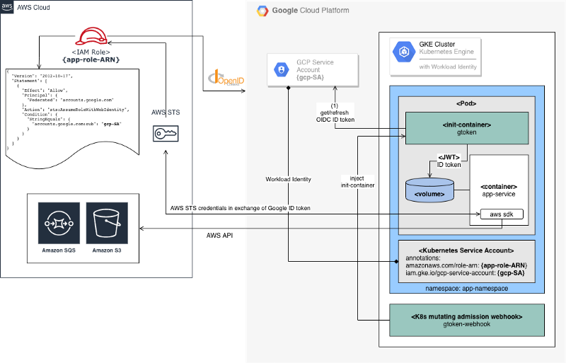

# `token-injector` Kubernetes Mutating Admission webhook
This solution helps to get and exchange a Google OIDC token for temporary AWS IAM security credentials generated by the AWS STS service. This approach allows accessing AWS services from a GKE cluster without pre-generated long-living AWS credentials.

## General Info
It is not uncommon for an application running on Google Kubernetes Engine (GKE) to need access to Amazon Web Services (AWS) APIs.

Google Cloud announced a **Workload Identity**, the recommended way for GKE applications to authenticate to and consume other Google Cloud services. Workload Identity works by binding Kubernetes service accounts and Cloud IAM service accounts, so you can use Kubernetes-native concepts to define which workloads run as which identities. This permits your workloads to automatically access other Google Cloud services without managing Kubernetes secrets or IAM service accounts.

Amazon Web Services supports similar functionality with the **IAM Roles for Service Accounts** feature. With IAM roles for service accounts on Amazon EKS clusters, you can associate an IAM role with a Kubernetes service account. This service account can then provide AWS permissions to the containers in any pod that uses that service account.

## Proposed Approach
The basic idea is to assign **AWS IAM Role** to GKE Pod, similarly to **Workload Identity** and **EKS IAM Roles for Service Accounts** cloud-specific features.

AWS allows creating an IAM role for OpenID Connect Federation (OIDC) identity providers instead of IAM users. On the other hand, Google implements OIDC provider and integrates it tightly with GKE through Workload Identity feature, providing a valid OIDC token to GKE pod, running under Kubernetes Service Account linked to a Google Cloud Service Account.

With properly configured **Workflow Identity**, GKE Pod gets an **OIDC access token** that allows access to Google Cloud services. To get temporary AWS credentials from the AWS Security Token Service (STS), you need to provide a valid **OIDC ID token**.

The AWS SDK will automatically request temporary AWS credentials from the STS service, when the following environment variables are properly set up:

- `AWS_WEB_IDENTITY_TOKEN_FILE` - the path to the web identity token file (OIDC ID token)
- `AWS_ROLE_ARN` - the ARN of the role to assume by Pod containers
- `AWS_ROLE_SESSION_NAME` - the name applied to this assume-role session

## `token-injector-webhook` Mutation Flow
The `token-injector-webhook` is a Kubernetes mutating admission webhook that mutates any k8s Pod running under [**specially annotated Kubernetes Service Account**](./cmd/token-injector-webhook/README.md) and labeled with
```yaml
admission.token-injector/enabled: "true"
```

The `token-injector-webhook`:
- Injects a `token-injector` as `initContainer` into a target Pod (to generate a valid **GCP OIDC ID Token** and write it to the token volume);
- Injects an additional `token-injector` sidecar container into a target Pod (to refresh an **OIDC ID token** a moment before expiration);
- Mounts the token volume to the main container in Pod;
- Injects three required AWS-specific environment variables.

The AWS SDK will automatically make the corresponding `AssumeRoleWithWebIdentity` calls to AWS STS on your behalf, handling in-memory caching as well as refreshing credentials as needed.

On high-level this `token-injector-webhook` mutation flow described on diagram below:


## `token-injector` Tool
The `token-injector` tool can get Google Cloud ID token when running under GCP Service Account (for example, GKE Pod with Workload Identity). Read [more](./cmd/token-injector/README.md).

## Mutating Webhook Configuration
All required steps for configuring Kubernetes Mutating Admission webhook are described in [separate document](./admission_webhook_configuration.md).

## External references
- [Amazon EKS Pod Identity Webhook](https://github.com/aws/amazon-eks-pod-identity-webhook)
- [Azure AD Workload Identity webhook](https://github.com/Azure/azure-workload-identity?tab=readme-ov-file)
- [MutatingWebhookConfiguration](https://dev-k8sref-io.web.app/docs/extend/mutatingwebhookconfiguration-v1/)

When we started to develop an Kubernetes Admission Webhook we notice that there was a requirement that enforced by the apiserver for the admission webhook server and this is TLS connection so apiserver and admission webhook server must connect via TLS with each other. See: [Contacting the webhook](https://kubernetes.io/docs/reference/access-authn-authz/extensible-admission-controllers/#contacting-the-webhook). To ensure that we need a CA (Certificate Authority) and a client certificate which is signed by this CA.

For creation and signing certificate was created separate tool, which could be run as a Kubernetes Job:
- [Admission webhook certificator](https://github.com/ealebed/admission-webhook-certificator)

I've inspired the initial mutating admission webhook code from [doitintl/gtoken](https://github.com/doitintl/gtoken/tree/master) repository. Big thanks to Alexei Ledenev!

## TODO:
- Finish Terraform implementation
- Retest *.yaml files implementation
- Create HELM chart for Admission webhook
